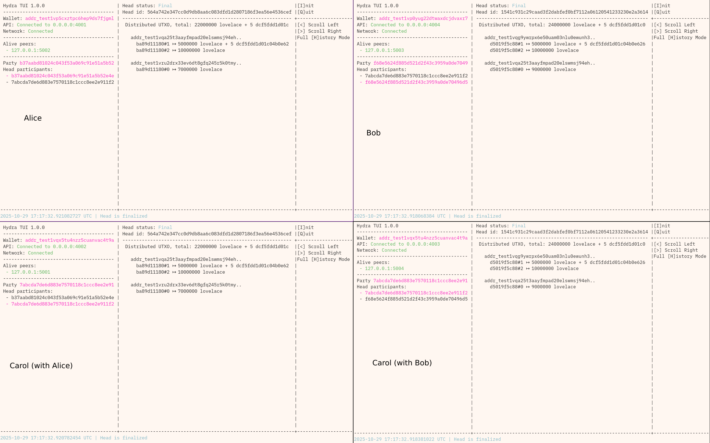

# hydra-lightning-router

Demonstration of routing a payment between two hydra heads using the
[htlc](https://github.com/cardano-scaling/htlc) validator and the
[invoice](https://github.com/cardano-scaling/hydra-invoices) representation.


> [!Note]
> In our implementation, "Ida" in the picture is called "Carol" in the code
> and TUI.

This is an implementation of [HTLC across two Hydra
Heads](https://github.com/cardano-scaling/hydra/issues/2080) and, for a setup
with:

- Alice in Head 1
- Bob in Head 2
- Carol in Head 1 _and_ Head 2

demonstrates:

1. Transferring Ada between Alice and Bob via a HTLC,
2. Transferring a CNT between Alice and Bob, via a HTLC.

## Demo



- [Video](images/out.mp4)

## Running

```
# In one terminal
nix run .#demo

# In another
cabal run hydra-lightning-router
```

## Tests

```
nix develop
cabal test all
```
